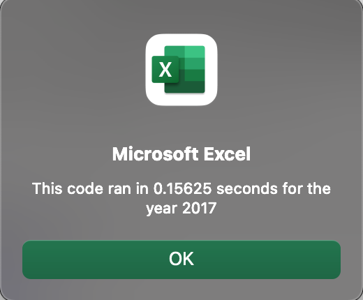
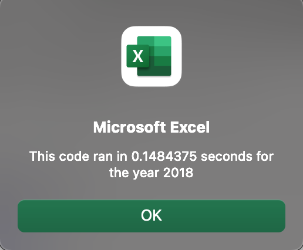

# VBA Challenge - Stock Analysis

## Purpose and Background

### Purpose

The purpose of the analysis was to refactor a previously created script to better its performance as measured by the timer function in VBA.

### Backgroung

The background of the analysis was a previous analysis that delved into Daily Volume, Starting Price, and Ending Price, of various "Green" stocks to determine total Volume and Return for the years 2017 and 2018, such that a user could evaluate them as potential investment opportunities. 

## Results

### Performance

In the original script, the subroutine to analyze year 2017 ran for 0.67 seconds, while the same subroutine ran 0.66 when using the year 2018 data. These numbers can be corroborated in the green_stocks.xlsm file uploaded in this repository. On the other hand, the refacoring (see below) carried out allowed for increased performance in the case of both years (and even though the original script did not run the formatting portion of the script; as formatting was part of another subroutine). The performance achived for the refactored script was 0.16 and 0.15 seconds approximately when running on 2017 and 2018 data, respectively.

 



### Refactoring

The refactoring process involved the use of three output arrays and a ticker array, nested loops, and the use of a ticker index variable (tickerIndex). The crucial difference, that explains the increased performance of the refactored script versus the original relies on the fact that the latter script would loop serveral times across the rows of the data, while the former loops only once across the rows of the data. The ticker index variable, allows for the loop to adjust to the pertinent stock ticker through the following conditional:

```
If Cells(i, 1).Value <> Cells(i + 1, 1).Value Then
            
            tickerIndex = tickerIndex + 1
            
            End If
```

## Summary

### Advantages and Disadvantages of refactoring code

The primary advantage of refactoring code is the increased performance that is likely to become relevant for more complex scripts. On the other hand, the primary disadvantage, I would argue, has to due with the risks involved if the person carrying out the refactoring is not accustomed to taking precautionary measures such as branching to ensure that the original script remains untouched and is only substituted for if the refactored script proves to have a better performance.

### Pros and Cons applied to the original script in this analysis

With respect to the aforementioned advantage and disadvantages, the increase in performance as measured by the VBA Timer function has already been commented above in "### Results" section. On the other hand, throughout the process of refactoring, a copy was maintained of the original script, such that if the end result did not satisfy, the analysis could still be carried out by the original script.


